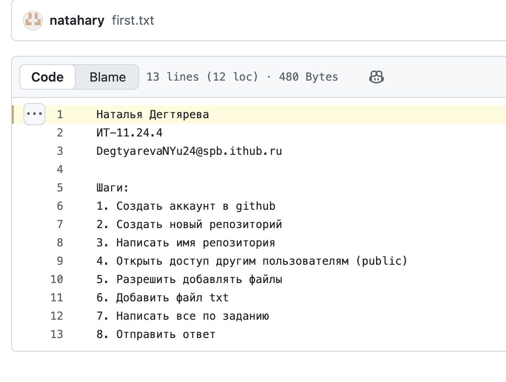

# Задание 2

**Наталья Дегтярева**
*ИТ-11.24.4*
*DegtyarevaNYu24@spb.ithub.ru*

## Шаги:
'1. Создать аккаунт в github'
'2. Создать новый репозиторий'
'3. Написать имя репозитория'
'4. Открыть доступ другим пользователям (public)'
'5. Разрешить добавлять файлы'
'6. Добавить файл txt'
'7. Написать все по заданию' 
'8. Отправить ответ'

### Скриншот:

