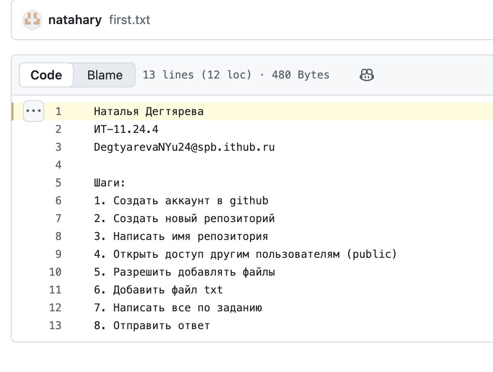

# Задание 2

**Наталья Дегтярева**
*ИТ-11.24.4*
*DegtyarevaNYu24@spb.ithub.ru*

## Шаги:
```
1. Создать аккаунт в github
2. Создать новый репозиторий
3. Написать имя репозитория
4. Открыть доступ другим пользователям (public)
5. Разрешить добавлять файлы
6. Добавить файл txt
7. Написать все по заданию 
8. Отправить ответ
```

## Инструкция по выгрузке (get pull):
```
1. Открыть терминал или командную строку.
2. Перейnb в директорию вашего локального репозитория:
3. Выполнить команду для получения и слияния изменений с основного удаленного репозитория:
```
git pull origin main
```
5. Выполнить:
```
git add <имя_файла>git commit
```
6. Проверить успешность обновления командой:
```
git status


## Инструкция по загрузке (git push):
```
1. Открыть терминал или командную строку.
2. Перейти в директорию вашего локального репозитория:
```
 cd /путь/к/вашему/репозиторию
```
3. Убедиться, что все изменения закоммичены:
```
git status
```
4. Отправить изменения в удалённый репозиторий:
```
git push origin main
```
5. Ввести свои учетные данные, если потребуется (логин/пароль или токен доступа).
6. Проверить успешность операции сообщением в терминале.
```

### Скриншот:



